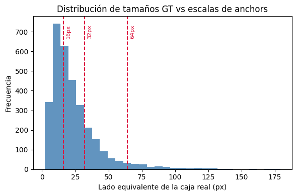

# MANIFEST_IA — Taller 3: RPN híbrido multi-objeto sobre FundidoraPC

**Integrantes:** Annie Sofia Correa, Miguel David Arroyo, Juan Andres Hoyos, Daniela Marin Villacorte y Fabian Andres Gomezcasseres.

Trabajamos con Aquarium Combined, con 7 clases más fondo e imágenes de 224 x 224. El modelo final fue el de la época 30: obtuvo un recall de propuestas de 0.742 y un mAP@0.5 de 0.1195.

## 1. ¿Por qué las propuestas necesitan `.detach()` antes de ROI Align, y qué pasaría si se omite?

El RPN propone cajas para decir dónde podría haber un objeto. ROI Align usa esas cajas para recortar la parte correspondiente del mapa de características y la cabeza de detección decide qué objeto es. Usamos `.detach()` para separar esas dos tareas: el RPN aprende a ubicar objetos con `rpn_loss` y la segunda etapa aprende a clasificar y ajustar las cajas con `detection_loss`.

Si no usáramos `.detach()`, la pérdida de detección intentaría cambiar directamente las cajas propuestas por el RPN a través de ROI Align. Como esa selección de cajas no permite un gradiente útil, el entrenamiento puede ser inestable, fallar silenciosamente o dar un error de grafo. El backbone sí sigue aprendiendo de ambas pérdidas; solo se corta el gradiente hacia las coordenadas de las propuestas. En nuestro código lo verificamos antes de usar `roi_align`.

## 2. ¿Por qué el mapa de objectness y el Smooth Grad-CAM no coinciden exactamente?

**Coincidencia espacial observada:** no coinciden espacialmente. En las cinco imágenes, el objectness del RPN se concentra en zonas con forma de objeto y ocupa cerca del 20 % del mapa. En cambio, Smooth Grad-CAM quedó vacío en 2 de 5 imágenes y, en las otras, solo dejó puntos pequeños en las esquinas, un efecto del padding. La coincidencia fue baja: la correlación promedio fue 0.16 y el IoU entre sus zonas altas fue 0.146.

Esto tiene sentido en nuestros resultados. El objectness es class-agnostic: busca dónde hay cualquier objeto. Smooth Grad-CAM es class-discriminative: muestra qué parte de la región usó la red para decidir una clase concreta. Los logits de la clase analizada fueron negativos en las cinco imágenes; por eso el ReLU eliminó casi todo el CAM. En dos casos, además, el modelo predijo `jellyfish` sobre un frailecillo y sobre un tiburón, así que es coherente que la evidencia para esa clase sea negativa. El Grad-CAM contrafactual fue muy difuso y destacó sobre todo fondo, como roca, arena y agua.

Nuestra conclusión es que el RPN aprendió mejor dónde hay algo que la segunda etapa qué especie es: el recall llegó a 0.742, pero el mAP final fue 0.1195. Como muchos objetos son pequeños después del resize, las regiones incluyen bastante fondo. El hecho de que los mapas sean casi disjuntos es un hallazgo de nuestro modelo, no un error que escondemos.

## 3. Una decisión de diseño del grupo: usar anchors de escalas (16, 32, 64) y 9 anchors por celda

El histograma de las 3219 cajas reales muestra que los objetos suelen ser pequeños: p25 = 11.9 px, mediana = 18.8 px y p75 = 30 px. Por eso, las escalas comunes de (32, 64, 128) resultaban grandes para este conjunto. Probamos tres opciones sobre 40 imágenes de entrenamiento: (16, 32, 64) obtuvo el mejor IoU promedio con las cajas reales, 0.485, frente a 0.454 para (24, 48, 96) y 0.408 para (32, 64, 128).

El grupo decidió usar (16, 32, 64) con tres proporciones, es decir, 9 anchors por celda. Cuando el recall inicial fue bajo, no cambiamos los anchors porque ya eran los que mejor cubrían los objetos. En su lugar revisamos el muestreo: había aproximadamente una positiva por cada 84 negativas. Al corregirlo a 1:1 el recall subió de 0.45 a 0.55, y con el entrenamiento conjunto llegó a 0.742.
